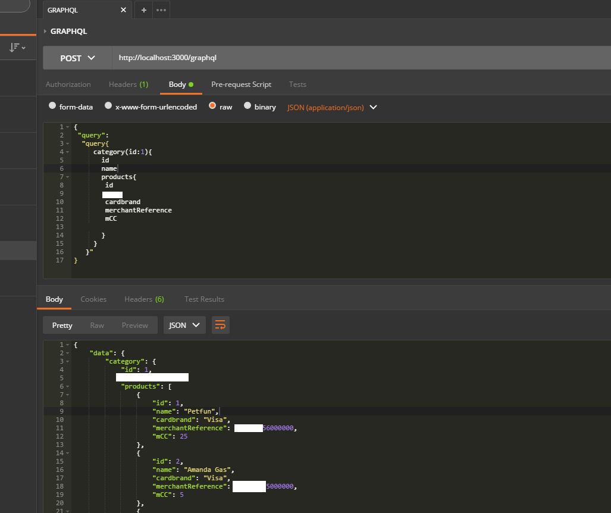

[ ](https://travis-ci.org) 
### Financial API modeling using .NET core 2 + GraphQL 
### The server response returns the graph nodes requested by each query
#
### Steps to run:
#
#### Using dotnet core CLI:
```diff
+ $ dotnet restore
+ $ dotnet build
+ $ dotnet run 
```
#
#### you may check the endpoints at http://localhost:3000/  or 
#### query the API using Postman:
#

#
#### The GraphQL aproach offer the best of both SOAP and REST plus some awesome features:
#### is strongly typed, uses standard protocols (HTTP), efficient/modern data payloads, less network roundtrip by multiplexing the endpoint, etc..
#
#### to learn more about GraphQL: https://graphql.org/


